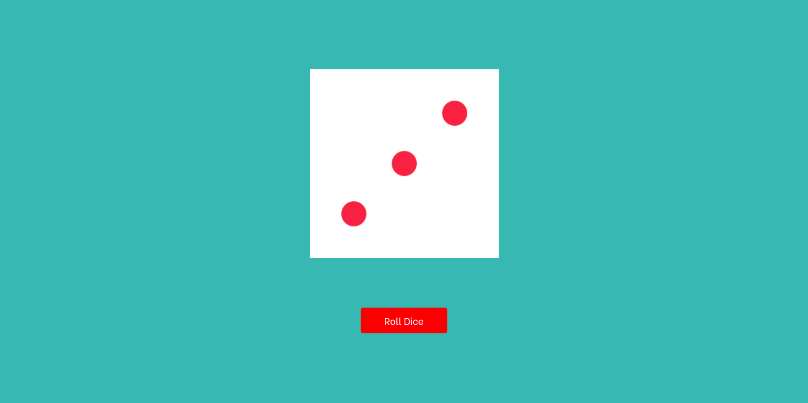

# Game Science Assessment - Roll Dice

This project is an assessment for the Frontend Developer Role at Game Science. And it's being built with React. I make use of the [Rolz API](https://rolz.org/help/api) to get the dice data and then show a graphical representation of the dice in the app's UI.

## How it looks like

## Process

### The app has mainly two components; a button and a dice component.

1. The button, when pressed fetch the dice data from the api and then update the dice state with the data from the api call. Once the state is updated and has some values in it, the app then renders the graphical representation by mapping through it and then passing the respective data down to the Dice component.

2. The dice component gets the value as it's being passed into it from the .map() method, and then use the prop to determine the dice to be rendered to the screen within the range of 1-6.

## To run and test this app, these are the available Scripts

To run the project locally, run:

### `yarn start`

Runs the app in the development mode.\
Open [http://localhost:3000](http://localhost:3000) to view it in the browser.

### `yarn test`

I also implemented testing with Jest and Enzyme. To test the project, run `yarn test`.\ This will launch the test runner in the interactive watch mode.
